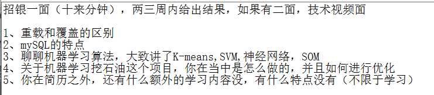

### **面试日程：** 

| 公司 | 应聘岗位 |面试时间段 |
| :------------- |:-------------|:-------------|
|[招银](#zhaoyin) | C++ | |
|[搜狐](#sohu) | 后台开发+算法工程师 | |
|[百度](#baidu) | 软件研发（C++）| |
|[58](#58) | 算法工程师| |
|[网易有道](#网易有道) | 研发工程师| |
----
### <a id="zhaoyin"> 招银 </a>
#### 电话一面

----
### <a id="sohu"> 搜狐 </a>
#### 媒体后台一面：
- 1、自我介绍
- 2、小岛那道题讲思路
- 3、链表翻转的递归解法，非递归解法·
- 4、SQL中存储索引用的是哪种数据结构，我说用hashmap,他说用b+树，给了几分钟思考为什么用b+树
- 5、TDOA的数学思想
- 6、什么是多态
- 7、讲机器学习常用算法
- 8、什么是python的修饰器

忘了。。。就说我不会java不会python，不懂后端

#### 算法二面：
- 1、自我介绍
- 2、TDOA的数学原理
- 3、为什么想来北京发展
- 4、一个数组a，x,y,z都是a中的元素且满足x=y+z，求最大的x；给出解法及其时间复杂度

#### 大佬三面：
- 1、自我介绍
- 2、有哪些分类算法
- 3、朴素贝叶斯公式及其核心思想
- 4、如何评判一个分类器的好坏，如何评价一个聚类结果的好坏
- 5、K-means原理
- 6、如果查准率高，查全率低，这个分类器有什么问题
- 7、如果查准率一般，查全率高，这个分类器有什么问题
- 8、两个聚类算法，如何评价两者性能好坏，在只聚类一次的情况下，又如何评价其性能好坏
- 9、训练样本不均匀情况下，你有哪些处理
- 10、ROC,AOC区别
- 11、为啥想来北京，为啥想做机器学习
- 12、兴趣爱好，双休日都在干啥

----
### <a id="baidu"> 百度 </a>
#### 软开瞎面：
- 1、	自我介绍，然后。。。你通信工程的啊，不太适合软件研发
- 2、	计算机存储的数据是精确的吗，写出浮点型在电脑中是怎么存的
- 3、	归并排序
- 4、	线程进程
- 5、	有一个字符串，找出两个不相交 回文子串 的对数（最佳解法O(nlogn)，面试官说一个搞ACM的写了50分钟写出来，直接通过一面，其他问题都没问）
- 6、	如何提取验证码中的字符

----
### <a id="58"> 58 </a>
#### 算法一面：
- 1、    自我介绍
- 2、    写快排，讲解快拍核心思想
- 3、    用过哪些聚类算法，讲K-means，DBSCAN的核心思想
- 4、    稀疏字编码器工作原理
- 5、    前馈神经网络训练原理，BP算法中节点偏置b的含义

#### 算法二面：
- 1、    自我介绍
- 2、    详细描述一个你最熟悉的项目，整个流程
>* 稀疏自编码器
>* K-means
>* 数据的采样处理
>* 题外话：条件随机场+回归模型
- 3、 算法有很多方面，你想具体做哪一个

#### HR终面
- 1、    自我介绍
- 2、    为什么想来北京发展
- 3、    投过哪些公司，拿了哪些offer
- 4、    讲机器学习项目，看表达能力的吧
- 5、    做的比赛，为什么喜欢做这些，红外莫尔斯密码锁这个比赛具体是什么
- 6、    你有什么想问我的吗

----
### <a id="网易有道"> 网易有道 </a>
#### 研发一面：
- 1、    自我介绍
- 2、    什么是进程线程，有什么区别
- 3、    什么是主键外键
- 4、    指针和引用区别
- 5、    编程：输出二叉树根节点到叶子结点最大和路径
- 6、    顺时针打印矩阵