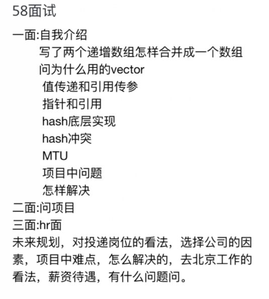

### **面试日程：** 

| 公司 | 应聘岗位 |面试时间段 |
| :------------- |:-------------|:-------------|
|[百度系统部](#baidu_xitongbu) | C++ |   |
|[58同城](#58) | C++ | |
---
### <a id="baidu_xitongbu"> 百度系统部 </a>
#### 一面
- TCP/UDP区别
- TCP 3次4次
- UDP的可靠连接
- 什么时候用TCP，UDP。问得挺深的
- OSI
- 进程通信方式
- 静态变量与实例变量
- overload重载 overwrite重写
- 之后问了一下自己的优势是什么
- 然后介绍他们做的是什么

----
### <a id="58"> 58同城 </a>
